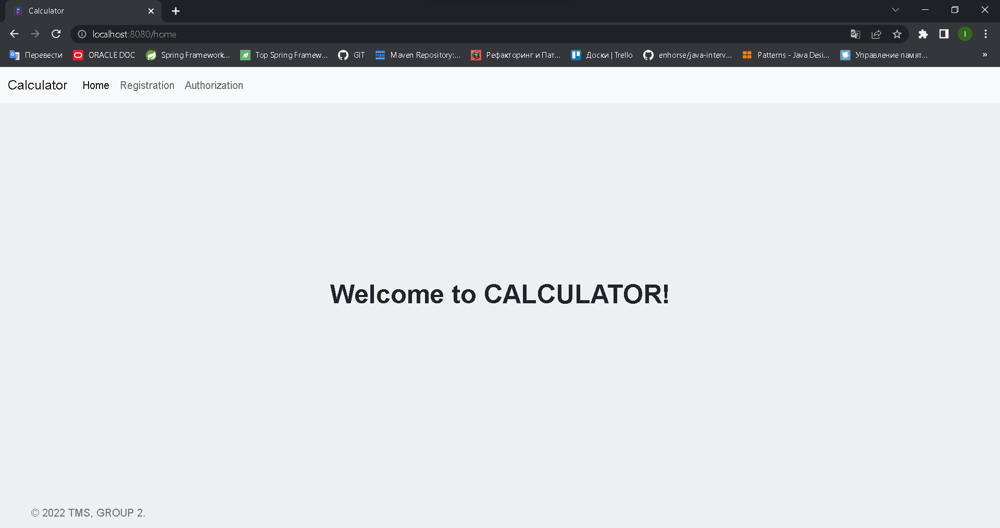
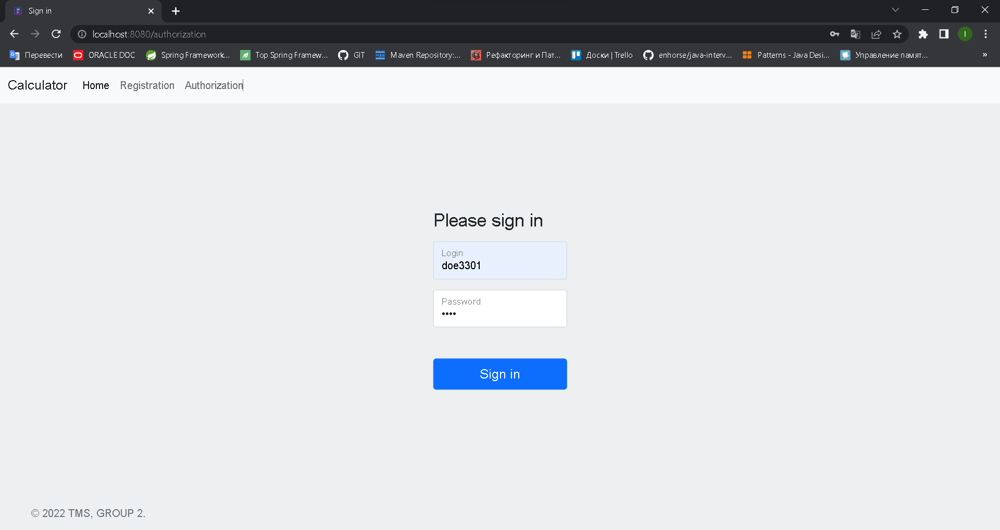
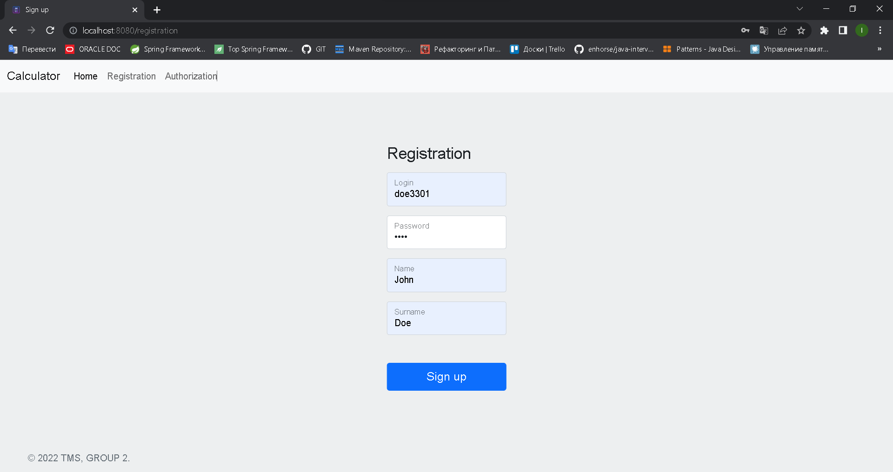
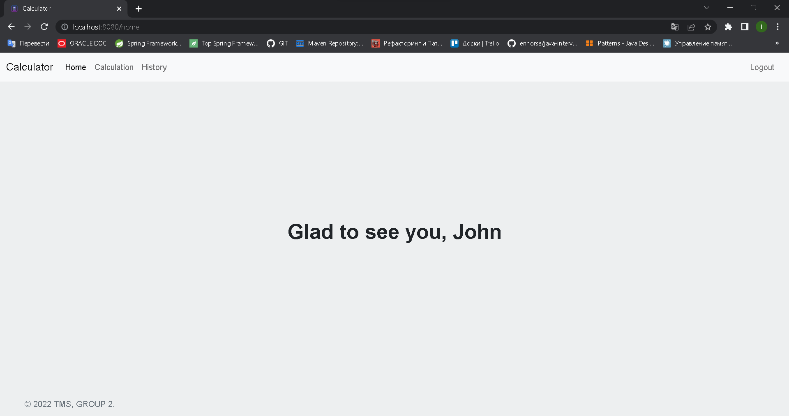
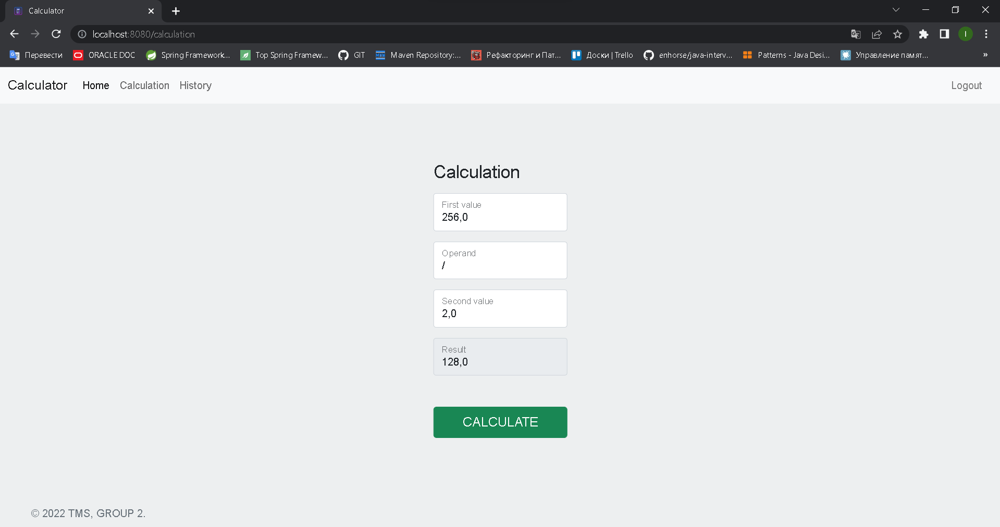
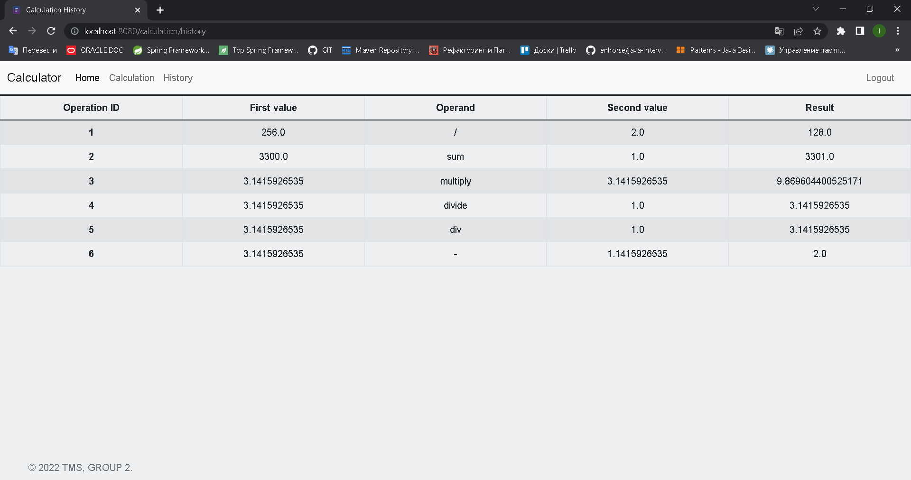

# TMS Group Task

## Servlet, JSP, JSTL training.

--- 

## Table of contents

### 1. [Task description](https://github.com/IvanHayel/TMS_Group_2_Task#task-description)

### 2. [Distribution of responsibility](https://github.com/IvanHayel/TMS_Group_2_Task#distribution-of-responsibility)

### 3. [Tasks in progress](https://github.com/IvanHayel/TMS_Group_2_Task#tasks-in-progress)

### 4. [Completed tasks](https://github.com/IvanHayel/TMS_Group_2_Task#completed-tasks-)

### 5. [How it works?]()

### 6. [Clone and run project. Step by step.](https://github.com/IvanHayel/TMS_Group_2_Task#clone-and-run-project-step-by-step)

--- 

### Task description

> Implement 4 servlets:
> 1) AuthorizationServlet (hide if already authorized)
> 2) RegistrationServlet (hide if already authorized)
> 3) CalculationServlet (only for authorized user)
> 4) CalculationHistoryServlet (only for authorized user)
>
> In the `history`, output all operations with a formatted date when this operation was made.
> Additionally: write unit tests and arrange logs.

---

### Distribution of responsibility

|        **Dev**         | **Realize**                                                                           |
|:----------------------:|:--------------------------------------------------------------------------------------|
| **Jana + ~~Andrian~~** | `Entity`, `EntityStorage`                                                             |
|        **Jana**        | `User`, `UserService`, `RegistrationServlet`, `AuthorizationServlet`, `LogoutServlet` |
|    **~~Andrian~~**     | `Operation`, `OperationService`, `CalculationServlet`, `CalculationHistoryServlet`    |
|      **Dmitriy**       | `AuthorizationFilter`, `Home page` (html, css, bootstrap, jsp, jstl)                  |

---

### Tasks in progress

- [ ] `Cover with unit tests`
- [ ] `Cover with logs`

### Completed tasks ✅

- [X] `Entity`
- [X] `EntityStorage`
- [X] `User`
- [X] `UserService`
- [X] `RegistrationServlet`
- [X] `AuthorizationServlet`
- [X] `LogoutServlet`
- [X] `AuthorizationFilter`
- [X] `Operation`
- [X] `OperationService`
- [X] `CalculationServlet`
- [X] `CalculationHistoryServlet`
- [X] `Frontend`

---

### How it works?

#### Home view

#### Authorization view

#### Registration view

#### Home view after authorization

#### Calculation view

#### Calculation history view

---

### Clone and run project. Step by step.

---

---

---

---

---

---

---

---

---

---

---

---

